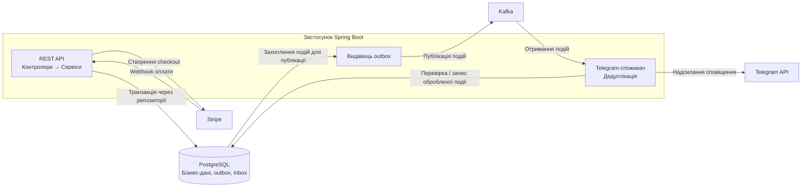

# StayHub Booking Service — український опис

`booking-app` — REST бекенд для керування бронюваннями помешкань. Проєкт написано на Java 21 та Spring Boot 4. Він надає захищене JWT API для акаунтів, каталогу помешкань, бронювань і оплат через Stripe, а також публікує бізнес-події в Kafka й надсилає Telegram-сповіщення.

> Англомовний опис: [README.md](README.md).

## Можливості

- реєстрація, вхід і JWT-автентифікація;
- публічний перегляд каталогу помешкань;
- створення, редагування, скасування та перегляд бронювань;
- адміністрування помешкань і ролей користувачів;
- створення Stripe Checkout-сесій та обробка підтверджених оплат;
- контроль перетинів дат бронювань і місткості помешкання на рівні БД;
- автоматичне завершення прострочених бронювань за розкладом;
- надійна доставка подій через transactional outbox, Kafka та дедуплікацію споживача;
- Telegram-сповіщення про вибрані бізнес-події;
- Liquibase-міграції, health checks, метрики, кореляційні ідентифікатори та опційне OpenTelemetry-трасування.

## Технології

- Java 21, Maven, Spring Boot 4.0.3;
- Spring Web MVC, Validation, Security, Data JPA, Actuator;
- PostgreSQL 17 та Liquibase;
- Apache Kafka (Confluent Platform 7.8.7);
- Stripe Java SDK, Telegram Bot API;
- springdoc OpenAPI / Swagger UI;
- MapStruct, Lombok;
- JUnit 5, Mockito, Testcontainers, JaCoCo та Checkstyle;
- Docker і Docker Compose; Jaeger 2.20.0 — для локального перегляду трас.

## Архітектура

Код організовано за шарами:

- `com.bookingapp.domain` — доменні моделі, переліки станів, події та правила предметної області;
- `com.bookingapp.service` — прикладні сценарії й транзакційна бізнес-логіка;
- `com.bookingapp.web` — HTTP-контролери, DTO, мапери та обробка помилок;
- `com.bookingapp.persistence` — JPA-сутності, репозиторії, outbox та inbox;
- `com.bookingapp.infrastructure` — безпека, Kafka, Stripe, Telegram, scheduler, конфігурація й observability.

Синхронний потік: `Controller → Service → Repository / Infrastructure`.

Асинхронний потік: `Service → outbox_events → OutboxKafkaPublisher → Kafka → Telegram consumer → Telegram API`.



Видавець outbox і споживач працюють у межах застосунку; Kafka відокремлює
публікацію подій від обробки сповіщень.

Події зберігаються в БД у межах тієї самої транзакції, що й бізнес-зміна. Видавець забирає їх пакетами, використовує lease для безпечної роботи кількох інстансів і повторює невдалі публікації. Споживач веде таблицю оброблених подій, щоб не надсилати сповіщення повторно за звичайного повторного доставлення Kafka.

## Передумови

- JDK 21;
- Maven 3.9+;
- Docker Desktop або сумісний Docker Engine — для PostgreSQL, Kafka та запуску через Compose;
- облікові дані Stripe і Telegram, якщо потрібні реальні оплати та сповіщення.

## Конфігурація середовища

Скопіюйте шаблон і замініть усі шаблонні значення:

```powershell
Copy-Item .env.sample .env
```

`.env` не додається до Git. Він є джерелом локальних значень для Docker Compose; Maven автоматично його не зчитує. Для запуску застосунку без контейнера передайте змінні середовища у вашому терміналі або через конфігурацію запуску IDE.

Ключові змінні:

| Група | Змінні |
| --- | --- |
| База даних | `DB_HOST`, `DB_PORT`, `DB_NAME`, `DB_USERNAME`, `DB_PASSWORD`, `POSTGRES_DB` |
| Безпека | `JWT_SECRET`, `JWT_EXPIRATION_MINUTES` |
| Обмеження автентифікації | `AUTH_RATE_LIMIT_LOGIN_ATTEMPTS`, `AUTH_RATE_LIMIT_REGISTER_ATTEMPTS`, `AUTH_RATE_LIMIT_WINDOW_SECONDS`, `AUTH_RATE_LIMIT_MAX_CLIENTS` |
| Kafka | `KAFKA_BOOTSTRAP_SERVERS`, `KAFKA_CONSUMER_GROUP_ID`, `KAFKA_TOPIC_*` |
| Stripe | `STRIPE_SECRET_KEY`, `STRIPE_WEBHOOK_SECRET`, `STRIPE_SUCCESS_URL`, `STRIPE_CANCEL_URL`, `STRIPE_CURRENCY` |
| Telegram | `TELEGRAM_BOT_TOKEN`, `TELEGRAM_CHAT_ID` |
| Розклад | `BOOKING_EXPIRATION_CRON` |
| Трасування | `SPRING_PROFILES_ACTIVE`, `TRACING_ENDPOINT`, `TRACING_SAMPLING_PROBABILITY` |

**Відоме обмеження rate limiting:** лічильники спроб входу й реєстрації
зберігаються в пам'яті кожного інстансу та скидаються після перезапуску.
Репліки не обмінюються лічильниками, тому спільного ліміту для всього кластера
немає. Для кількох інстансів потрібен спільний механізм обмеження, наприклад
на API gateway або з лічильниками в Redis.

`JWT_SECRET` обов'язковий: це Base64-рядок, який після декодування містить щонайменше 32 випадкові байти. Застосунок не запуститься з порожнім, некоректним або закоротким ключем. Приклад генерації в PowerShell:

```powershell
$bytes = [byte[]]::new(32)
$rng = [System.Security.Cryptography.RandomNumberGenerator]::Create()
$rng.GetBytes($bytes)
$rng.Dispose()
$env:JWT_SECRET = [Convert]::ToBase64String($bytes)
```

Не змінюйте ключ без потреби: усі раніше видані токени стануть невалідними. Для Stripe також потрібен `STRIPE_WEBHOOK_SECRET`; webhook без нього не налаштовується.

Кожен автентифікований запит перевіряє підпис і строк дії JWT, а потім один
раз шукає користувача в БД за незмінним claim `userId`. Поточні email і роль із
БД стають principal та authorities: зміна ролі діє з наступного запиту, а
зміна email не ламає ідентифікацію. Відсутній користувач отримує 401, а збій
lookup БД — оброблений 5xx, не помилку «невірний токен». TTL JWT не є
механізмом миттєвого відкликання: токен може залишатися чинним до завершення
строку дії, якщо lookup користувача його не відхилить.

Email облікового запису є нечутливим до регістру. Реєстрація, вхід і оновлення
профілю зберігають `trim().toLowerCase(Locale.ROOT)`, тому початковий регістр і
пробіли навколо адреси навмисно не зберігаються. Міграція email незворотна щодо
цього форматування: rollback DB-обмеження не відновлює попередні значення.

Неявного профілю Spring немає. Профіль `dev` потрібно обирати явно
(`SPRING_PROFILES_ACTIVE=dev` у шаблоні); він вмикає діагностичний SQL та
логи bind-параметрів. Без нього SQL і bind TRACE вимкнені. Для запуску
застосунку та Compose обов'язковий `DB_PASSWORD`, а Compose також вимагає
`SPRING_PROFILES_ACTIVE`. Шаблонні значення Stripe/Telegram у `.env.sample`
є лише документацією і відхиляються startup-валідацією.

## Запуск локально

1. Створіть `.env` із `.env.sample` та заповніть секрети.
2. Запустіть залежності:

   ```powershell
   docker compose up postgres kafka kafka-ui -d
   ```

3. Встановіть необхідні значення середовища (зокрема `JWT_SECRET`) і запустіть застосунок:

   ```powershell
   mvn spring-boot:run
   ```

Типові адреси для локального запуску: PostgreSQL — `localhost:5433`, Kafka — `localhost:9092`, застосунок — `http://localhost:8080`.

## Запуск у Docker Compose

Для запуску всього стеку виконайте:

```powershell
docker compose up --build
```

Контейнер `booking-app` читає `.env`, але отримує внутрішні адреси `postgres:5432` та `kafka:29092` з `docker-compose.yml`. Дані PostgreSQL і Kafka зберігаються в іменованих Docker volumes.

Після старту доступні:

- API: `http://localhost:8080`;
- Swagger UI: `http://localhost:8080/swagger-ui.html`;
- OpenAPI: `http://localhost:8080/api-docs`;
- custom health: `http://localhost:8080/health`;
- Actuator health: `http://localhost:8080/actuator/health`;
- Kafka UI: `http://localhost:8081`.

## API та доступ

Повна специфікація і формати DTO доступні у Swagger UI. Усі захищені запити передають токен як `Authorization: Bearer <JWT>`.

| Метод | Шлях | Доступ / призначення |
| --- | --- | --- |
| `POST` | `/auth/register` | Публічна реєстрація клієнта |
| `POST` | `/auth/login` | Публічний вхід і отримання токена |
| `GET` | `/accommodations`, `/accommodations/{id}` | Публічний каталог і деталі |
| `POST` | `/accommodations` | ADMIN: створити помешкання |
| `PUT`, `PATCH`, `DELETE` | `/accommodations/{id}` | ADMIN: змінити або видалити помешкання |
| `POST` | `/bookings` | Авторизований: створити бронювання |
| `GET` | `/bookings`, `/bookings/my`, `/bookings/{id}` | Авторизований: список/власні/деталі; ADMIN має розширений доступ |
| `PUT`, `PATCH`, `DELETE` | `/bookings/{id}` | Авторизований: змінити дати або скасувати за правилами доступу |
| `GET`, `POST` | `/payments` | Авторизований: список оплат або створення/reuse Checkout-сесії |
| `POST` | `/payments/webhook` | Stripe webhook, перевіряється заголовок `Stripe-Signature` |
| `GET` | `/payments/success` | Публічне нейтральне повернення після Checkout; статус підтверджує лише webhook |
| `GET` | `/payments/cancel/return` | Публічне нейтральне повернення зі скасованого checkout |
| `GET` | `/payments/cancel` | Авторизований локальний статус платежу за `booking_id` або `session_id`, без Stripe reconciliation |
| `GET`, `PUT`, `PATCH` | `/users/me` | Авторизований профіль і його зміна |
| `PUT` | `/users/{id}/role` | ADMIN: змінити роль |
| `GET` | `/health`, `/actuator/health` | Публічні перевірки стану |

Ролі: `CUSTOMER` працює зі своїми даними та бронюваннями; `ADMIN` керує помешканнями, ролями користувачів і має розширений доступ до списків. Вхід і реєстрація мають rate limiting за IP-адресою.

## Бронювання й платежі

База даних не дозволяє накладення підтверджених діапазонів бронювання одного помешкання. Після створення першої платіжної спроби дати бронювання вже не редагуються. Створення Checkout-сесії та зміна дат серіалізовані для одного бронювання, тому сума не може бути розрахована за застарілими датами.

Кожна спроба оплати фіксується перед зверненням до Stripe та має власний ідемпотентний ключ. Повторний запит повертає активну/оброблювану сесію; після завершення її строку створюється новий запис спроби. Для скасованого, простроченого або вже оплаченого бронювання Checkout не створюється. Скасування закриває неоплачені Stripe-сесії; для оплаченої броні повернення коштів не виконується автоматично.

Webhook приймає `checkout.session.completed` і `checkout.session.async_payment_succeeded`. Він звіряє суму, валюту, бронювання та спробу оплати; повторні callback-и не створюють повторної події успіху.

Для локальної перевірки webhook можна використати Stripe CLI:

```powershell
stripe listen --events checkout.session.completed,checkout.session.async_payment_succeeded --forward-to localhost:8080/payments/webhook
```

Секрет, який покаже команда, внесіть до `STRIPE_WEBHOOK_SECRET`.

## Observability і трасування

Кожна HTTP-відповідь містить `X-Correlation-ID`. Якщо клієнт передає допустиме значення (1–64 символи: латинські літери, цифри, `.`, `_`, `-`), воно приймається; інакше генерується UUID. Кореляційний ID зберігається в outbox та передається в Kafka headers.

Профіль `dev` використовує читабельні логи й SQL-логування для локальної розробки. Для JSON-логів увімкніть профіль `observability`:

```powershell
$env:SPRING_PROFILES_ACTIVE = 'observability'
```

Actuator експонує `health`, `info` і `metrics`. `GET /actuator/metrics` та `GET /actuator/info` потребують токен ролі ADMIN. Зокрема доступні метрики `booking.flow.events`, `booking.flow.duration`, `booking.outbox.events`, `booking.outbox.oldest.age.seconds` і `booking.outbox.snapshot.timestamp`.

Для локального перегляду трас у Jaeger увімкніть обидва профілі та сервіс Jaeger:

```powershell
docker compose --profile tracing up --build -d
```

У `.env` додайте `SPRING_PROFILES_ACTIVE=observability,tracing`. Jaeger буде доступний на `http://localhost:16686`; сервіс має назву `booking-app`. Без профілю `tracing` застосунок створює контекст і логи, але не має налаштованого OTLP exporter.

## Міграції БД

Liquibase запускається під час старту, а Hibernate працює у режимі `validate`. Головний changelog — `src/main/resources/db/changelog/db.changelog-master.yaml`. Він створює таблиці користувачів, помешкань, зручностей, бронювань, оплат, outbox, дедуплікації подій, а також обмеження місткості, перетину бронювань, lease обробника та поля correlation/trace context.

## Тести та перевірка якості

```powershell
mvn test
mvn verify
```

`verify` генерує JaCoCo-звіт і перевіряє мінімальне покриття рядків 60%, а Checkstyle запускається у фазі `compile`. Інтеграційні тести використовують Testcontainers PostgreSQL; у наборі також є перевірки контролерів, платежів, outbox/Kafka, трасування, міграцій та конкурентних бронювань.

## Структура репозиторію

```text
src/main/java/com/bookingapp/  вихідний код застосунку
src/main/resources/            профілі Spring і Liquibase-міграції
src/test/                      модульні та інтеграційні тести
ops/jaeger.yaml                конфігурація Jaeger для Compose
docker-compose.yml             локальна інфраструктура та застосунок
Dockerfile                     двостадійна збірка контейнера
.env.sample                    шаблон змінних середовища
```
