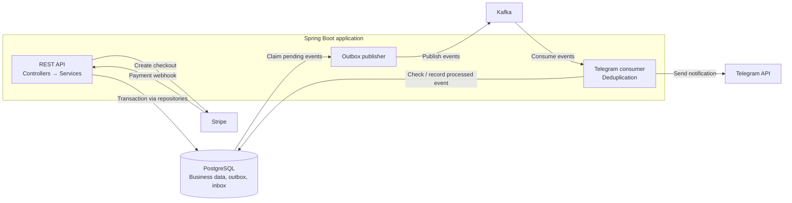

# StayHub Booking Service

This project is a Java 21 / Spring Boot 4 backend for accommodation booking management. It provides JWT-secured REST APIs for authentication, accommodation catalog management, bookings, payments, and operational notifications, while keeping a layered architecture built around `domain`, `web`, and `infrastructure`.

## Overview

The service supports:

- customer registration and login
- public accommodation browsing
- admin accommodation management
- booking creation, update, cancellation, and listing
- Stripe checkout session creation and payment completion handling
- Kafka-based event publishing through an outbox flow
- Telegram notifications for selected business events
- scheduled booking expiration
- schema management with Liquibase

## Tech Stack

- Java 21
- Spring Boot 4
- Spring Web MVC
- Spring Security
- Spring Data JPA
- PostgreSQL
- Liquibase
- Apache Kafka
- Stripe Java SDK
- Telegram Bot API
- springdoc OpenAPI / Swagger UI
- Maven
- Docker / Docker Compose
- JUnit 5, Mockito, Testcontainers, JaCoCo

## Architecture Summary

The application keeps the existing 3-layer structure:

- `com.bookingapp.domain`
  Business core: domain models, enums, domain events, repository contracts, business exceptions, and services.
- `com.bookingapp.web`
  HTTP API layer: controllers, request/response DTOs, web mappers, and API exception handling.
- `com.bookingapp.infrastructure`
  Technical adapters: persistence, JPA entities/repositories, security, Kafka, outbox publishing, Stripe, Telegram, configuration, and schedulers.

Main synchronous flow:

`Controller -> Service -> Repository / Infrastructure`

Main asynchronous flow:

`Service -> outbox event persistence -> OutboxKafkaPublisher -> Kafka -> Telegram consumer/notification service`



Business changes and their outbox events commit in the same database transaction.
The publisher and consumer run within the application; Kafka decouples event
publication from notification processing.

## Environment Configuration

Secrets and integration settings are externalized through environment variables. Start by copying `.env.sample` to `.env` and adjusting values if needed.

```bash
cp .env.sample .env
```

Important convention used by this project:

- `.env` is the source of truth for local development.
- Local development values target services exposed on the host machine.
- `docker-compose.yml` overrides only the `booking-app` container connection variables that must point to internal Compose service names.

Default local development values in `.env.sample` assume:

- PostgreSQL is reachable at `localhost:5433`
- Kafka is reachable at `localhost:9092`
- the app runs on `localhost:8080`

Required variables you should review before demo/use:

- `JWT_SECRET`
- `STRIPE_SECRET_KEY`
- `STRIPE_WEBHOOK_SECRET`
- `TELEGRAM_BOT_TOKEN`
- `TELEGRAM_CHAT_ID`

Authentication endpoints limit login and registration attempts per client address.
The defaults can be tuned with `AUTH_RATE_LIMIT_LOGIN_ATTEMPTS`,
`AUTH_RATE_LIMIT_REGISTER_ATTEMPTS`, `AUTH_RATE_LIMIT_WINDOW_SECONDS`, and
`AUTH_RATE_LIMIT_MAX_CLIENTS`.

**Known limitation:** authentication rate-limit counters are stored in memory
per application instance and reset on restart. Replicas do not share counters,
so this is not a cluster-wide limit; a multi-instance deployment needs a shared
limiter (for example, at an API gateway or backed by Redis).

`JWT_SECRET` is required. Generate a separate random key for each environment,
encoded as Base64 with at least 32 decoded bytes. The application refuses to
start with a missing, empty, malformed, or shorter key. Plain-text keys are not
supported. Do not reuse keys from examples or tests.

For PowerShell, generate a key in the current terminal environment without
printing it:

```powershell
$jwtKeyBytes = [byte[]]::new(32)
$jwtKeyGenerator = [System.Security.Cryptography.RandomNumberGenerator]::Create()
$jwtKeyGenerator.GetBytes($jwtKeyBytes)
$jwtKeyGenerator.Dispose()
$env:JWT_SECRET = [Convert]::ToBase64String($jwtKeyBytes)
```

Run `mvn spring-boot:run` from that terminal. For Docker Compose, populate
`JWT_SECRET` in the local, untracked `.env` file instead; `booking-app` receives
it through `env_file`. Maven does not automatically load `.env`.
Keep the key stable across restarts and shared by instances of the same
environment. Rotating it invalidates existing access tokens.

Database variables:

- `DB_HOST`
- `DB_PORT`
- `DB_NAME`
- `DB_USERNAME`
- `DB_PASSWORD`
- `POSTGRES_DB`

## Setup Instructions

Prerequisites:

- Java 21
- Maven 3.9+
- Docker Desktop or a compatible Docker engine if you want Compose-based dependencies/runtime

## Local Run

Use this mode when you want to run Spring Boot on your machine and keep PostgreSQL/Kafka externalized.

1. Copy `.env.sample` to `.env`.
2. Start infrastructure dependencies:

```bash
docker compose up postgres kafka kafka-ui -d
```

3. Run the application:

```bash
mvn spring-boot:run
```

The default local configuration from `application.yml` matches the host ports exposed by Docker Compose:

- PostgreSQL: `localhost:5433`
- Kafka: `localhost:9092`
- Application: `http://localhost:8080`

## Docker Compose Run

Use this mode when you want the full stack, including the application, in containers.

```bash
docker compose up --build
```

In Compose mode:

- PostgreSQL runs as `postgres:5432` inside the Compose network
- Kafka runs as `kafka:29092` inside the Compose network
- the `booking-app` container gets those internal addresses from `docker-compose.yml`

Public URLs after startup:

- API base URL: `http://localhost:8080`
- Swagger UI: `http://localhost:8080/swagger-ui.html`
- OpenAPI docs: `http://localhost:8080/api-docs`
- Custom health endpoint: `http://localhost:8080/health`
- Actuator health: `http://localhost:8080/actuator/health`
- Kafka UI: `http://localhost:8081`

## Health Endpoints

The project exposes:

- `GET /health`
  Public custom health endpoint returning:
  `{"status":"UP"}`
- `GET /actuator/health`
  Public Spring Boot actuator health endpoint

## Observability

HTTP responses include `X-Correlation-ID`. A supplied ID is accepted only when it
contains 1–64 ASCII letters, digits, dots, underscores or hyphens; otherwise a
new UUID is generated. The ID is stored in outbox migration `013` and forwarded
through Kafka headers. Scheduled events without an HTTP context receive their
own ID. Legacy outbox rows and Kafka records fall back to `eventId`.

For JSON console logs, set `SPRING_PROFILES_ACTIVE=observability` (including in
`.env` for Docker Compose). The default `dev` profile keeps readable logs and
adds correlation/event IDs. Avoid combining `dev` with production logging:
its SQL bind logging includes application data.

Flow logs use `stage`, `outcome`, `durationMs` and safe `errorType` fields.
Outbox publication includes `eventType`, `topic` and `attempt`; consumer logs
include Kafka `topic`, `partition` and `offset`. Retries preserve correlation
and each thread's logging context is restored after processing.
Application flow logs omit message payloads, credentials and raw exception
messages. Outbox `last_error` stores the exception class; Telegram failures
expose only an HTTP status or exception class, without retaining a cause that
could contain the bot token in its URL.

Metrics are available through `GET /actuator/metrics` and
`GET /actuator/metrics/{name}` with an ADMIN bearer token (401 without
authentication, 403 for a customer). `/actuator/info` also requires ADMIN.

| Metric | Meaning |
| --- | --- |
| `booking.flow.events` | Counts by bounded `stage`/`outcome`, including attempts, duplicates, retries, recovery and exhaustion |
| `booking.flow.duration` | Timer count/total/max for processing outcomes by `stage`/`outcome` |
| `booking.outbox.events` | Database-wide event counts by status |
| `booking.outbox.oldest.age.seconds` | Age of the oldest NEW, FAILED or PROCESSING event |
| `booking.outbox.snapshot.timestamp` | Unix seconds of the last successful queue-metrics refresh; zero until first refresh |

Outbox gauges refresh every 30 seconds (`app.outbox.metrics-delay-ms`). Check
snapshot freshness before trusting queue values. Every replica observes the
same database backlog: do not sum those gauges across replicas. IDs are log
fields, never metric tags. Log correlation and metrics work without an external
backend. Optional distributed tracing is described below.

### Telegram message did not arrive

1. Find the HTTP response's correlation ID or the booking's outbox event:

   ```sql
   SELECT id, correlation_id, event_type, status, attempts, last_error,
          created_at, published_at
   FROM outbox_events
   WHERE aggregate_type = 'Booking' AND aggregate_id = :booking_id
   ORDER BY created_at DESC;
   ```

   Payment events use `aggregate_type = 'Payment'` and the payment ID.
2. Search logs for `eventId` or `correlationId`. `outbox/committed` is logged
   after transaction commit. `outbox/published` and database status `SENT`
   mean Kafka accepted the record; they do not confirm Telegram delivery.
3. For NEW/FAILED/PROCESSING events, check publication failures, lease recovery
   and queue age. DEAD means the configured outbox attempt limit was reached.
   `claim_lost` means another worker owns the lease; inspect that worker's logs.
4. For SENT events, inspect consumer attempts and Kafka group lag. A
   `consumer/duplicate` indicates an already processed event. `telegram/accepted`
   means Telegram returned `ok=true`, not that a person read the message.
5. `consumer/exhausted` and `consumer/dead_letter` mean the event was published to
   `<source-topic>.DLT` after the configured retry attempts (four attempts with a
   one-second delay by default). Invalid event data is sent to the dead-letter topic
   immediately. Inspect its headers, topic, partition and offset, fix the cause, then
   replay it in a controlled way. A crash after Telegram acceptance but before
   recording deduplication can still produce a duplicate notification.

   Create each dead-letter topic with at least as many partitions as its source topic.

### Distributed tracing

The application uses Spring Boot's OpenTelemetry starter. HTTP server observations
and Spring Security spans share the same OpenTelemetry context as the async flow:

```text
HTTP / Spring Security
  └─ outbox.enqueue
       └─ outbox.publish (one span per publication attempt)
            ├─ telegram.consume (first delivery)
            │    └─ telegram.send
            └─ telegram.consume (retry)
                 └─ telegram.send
```

Migration `014` stores W3C `traceparent` and optional `tracestate` in the outbox.
Publishers resume this context after a restart and inject the publication span's
context into Kafka headers. Consumer retries are separate spans with the same
producer parent. `outbox.age.ms` records the elapsed time since event creation;
queue waiting is visible as a gap, without holding an open span across polling
or a restart. `outbox.enqueue` measures persistence work, while `outbox/committed`
in the logs confirms the transaction committed.

Legacy rows/records with missing or invalid trace context start a new trace;
their existing correlation ID/event ID still connects the logs. The W3C sampled
flag is preserved, so retries do not turn an unsampled event into a sampled one.
No baggage or arbitrary request headers are stored in the outbox.

`OutboxKafkaPublisher` instruments sends through the custom KafkaTemplate, and
`TelegramRecordInterceptor` instruments the custom listener factory. Automatic
Kafka observations are left off to avoid duplicate spans. `TelegramBotClient`
owns the CLIENT span around its RestClient call, recording method, destination
host, HTTP status and a safe error type. The Telegram URL, token, message body,
chat ID and raw exception are excluded from spans. The RestClient intentionally
has no additional automatic observation that could capture the secret-bearing URL.
`traceId` and `spanId` appear alongside correlation IDs in both log formats.

#### Local Jaeger viewer

For the full Compose stack, set `SPRING_PROFILES_ACTIVE=observability,tracing`
in `.env`, then run:

```bash
docker compose --profile tracing up --build -d
```

For an application running on the host, start only the dependencies:

```bash
docker compose --profile tracing up -d postgres kafka jaeger
```

Then activate `observability,tracing` in the application's environment, alongside
the normal application secrets. For example, in PowerShell:

```powershell
$env:SPRING_PROFILES_ACTIVE = 'observability,tracing'
mvn spring-boot:run
```

Open [Jaeger](http://localhost:16686), select service `booking-app`, or search for
the `traceId` from a log. Trigger a booking/accommodation event and allow time
for the outbox poll and exporter batch. A failing Telegram call produces an ERROR
span; repeated deliveries appear as sibling consumer spans. The terminal
`telegram.dead_letter` marks publication to the dead-letter topic.

| Setting | Default |
| --- | --- |
| `TRACING_ENDPOINT` with the Spring `tracing` profile | Host: `http://localhost:4318/v1/traces`; Compose app: `http://jaeger:4318/v1/traces` |
| `TRACING_SAMPLING_PROBABILITY` | `0.1` normally; `1.0` with `tracing` for local debugging |
| Trace export without the `tracing` profile | No exporter endpoint configured |

The Compose profile starts Jaeger; the Spring profile enables export. Both are
needed for the Compose demo. Jaeger's UI and OTLP receiver bind to loopback on
the host. Its bounded in-memory storage is for local inspection and is cleared
when the container restarts. Stopping it does not stop booking processing;
exported traces may be lost while the backend is unavailable. OTLP metrics export
is disabled; the Actuator metrics from the first stage remain available.

References: [Spring Boot OpenTelemetry integration](https://spring.io/blog/2025/11/18/opentelemetry-with-spring-boot/)
and [Jaeger deployment](https://www.jaegertracing.io/docs/2.20/deployment/).

## API Summary

`GET /bookings`, `GET /bookings/my` and `GET /payments` accept optional `page`
(default `0`) and `size` (default `20`, maximum `100`) parameters. They return a
page object with `content`, `page`, `size`, `totalElements` and `totalPages`.

Main business endpoints:

- `POST /auth/register`
  Register a new customer account.
- `POST /auth/login`
  Authenticate and receive a bearer token.
- `GET /accommodations`
  Public accommodation listing.
- `GET /accommodations/{id}`
  Public accommodation details.
- `POST /accommodations`
  Admin-only accommodation creation.
- `PUT /accommodations/{id}`
  Admin-only full accommodation update.
- `PATCH /accommodations/{id}`
  Admin-only partial accommodation update.
- `DELETE /accommodations/{id}`
  Admin-only accommodation deletion.
- `GET /bookings`
  Authenticated booking list with role-based behavior.
- `GET /bookings/{id}`
  Authenticated booking details.
- `POST /bookings`
  Authenticated booking creation.
- `PUT /bookings/{id}`
  Authenticated booking update.
- `PATCH /bookings/{id}`
  Authenticated booking partial update.
- `DELETE /bookings/{id}`
  Authenticated booking cancellation/deletion flow.
- `POST /payments`
  Authenticated checkout creation or reuse of the current session. An expired
  session can be replaced with a new attempt; previous attempts remain stored.
- `POST /payments/webhook`
  Stripe payment notification endpoint. Requires a valid `Stripe-Signature`
  header, not a bearer token. Supports `checkout.session.completed` and
  `checkout.session.async_payment_succeeded`.
- `GET /payments/success`
  Public Stripe success callback endpoint.
- `GET /payments/cancel`
  Authenticated checkout status lookup. Only the booking owner or an admin can
  retrieve the payment session, using `booking_id` or `session_id`. If both are
  supplied, they must identify the same booking. Anonymous requests receive 401;
  access to another customer's payment receives 403.
- `GET /payments/cancel/return`
  Public Stripe return endpoint with a generic message only. It exposes no
  payment details and does not change payment state.
- `GET /users/me`
  Authenticated current-user profile endpoint.
- `PUT /users/{id}/role`
  Admin-only role update.

Swagger is available at [http://localhost:8080/swagger-ui.html](http://localhost:8080/swagger-ui.html).

## Roles and Permissions

- Anonymous users:
  `POST /auth/**`, `GET /health`, `GET /actuator/health`,
  `GET /payments/success`, `GET /payments/cancel/return`, Swagger/OpenAPI
  endpoints, and public accommodation reads.
  `POST /payments/webhook` verifies Stripe's signature separately.
- `CUSTOMER`:
  authenticated booking/payment operations allowed by controller/service rules and access to their own profile.
- `ADMIN`:
  accommodation management and user role management, plus authenticated endpoints available to regular users where applicable.

## Payments and Notifications

Booking dates can be edited only before the first payment is created. Once
checkout is created, PUT/PATCH cannot change the dates, including after a
session expires. Create a new booking for a different period. Checkout creation
and date changes are serialized per booking so simultaneous requests cannot
leave a checkout amount based on old dates.

Each checkout attempt is committed before contacting Stripe and uses its stored
payment ID as an idempotency key. Requests are serialized per booking. Retrying
an open or processing session returns that session; renewing an expired session
creates a new payment row with the original amount and currency. A paid booking
cannot start another checkout. Session expiry is limited to 23 hours from the
attempt creation and never exceeds the booking's checkout date (server timezone).
Stripe requires at least 30 minutes of remaining session lifetime.

Creating checkout for a canceled/expired booking, or after its checkout date,
is rejected. Canceling a booking closes its unpaid Stripe sessions first. If
Stripe cannot confirm closure, cancellation fails and can be retried. A paid
booking requires a separate refund process before cancellation; refunds are not
automatically issued. The expiration job also closes unpaid sessions and waits
for processing payments to settle. A late successful payment is recorded without
reactivating a canceled/expired booking.

Successful callbacks verify the stored amount, currency, booking and attempt
against Stripe. Payment status and the outbox event commit in one transaction;
repeated or concurrent webhook/browser callbacks emit only one success event.
A signed webhook can recover a durable attempt by Stripe's `paymentId` metadata
if the session ID was not saved after a network failure.

Stripe setup notes:

- set `STRIPE_SECRET_KEY`
- set `STRIPE_WEBHOOK_SECRET` to the endpoint signing secret (`whsec_...`);
  the application will not start without it
- register `https://YOUR_HOST/payments/webhook` in Stripe for
  `checkout.session.completed` and `checkout.session.async_payment_succeeded`
- for local development, run
  `stripe listen --events checkout.session.completed,checkout.session.async_payment_succeeded --forward-to localhost:8080/payments/webhook`
  and use the signing secret printed by that listener
- verify `STRIPE_SUCCESS_URL` and `STRIPE_CANCEL_URL`
- local defaults point to `http://localhost:8080/payments/success` and `http://localhost:8080/payments/cancel/return`
- update an existing `STRIPE_CANCEL_URL` in `.env` to the new return endpoint
  (or your frontend return page). Existing Stripe sessions retain their original
  return URL; the old `/payments/cancel` URL now requires a bearer token.
- browser redirects from Stripe do not carry a bearer token. After returning,
  the frontend must authenticate and call `/payments/cancel` to retrieve private
  payment details. Never put the JWT in the return URL.

Webhook processing returns 503 for temporary processing failures so Stripe can
retry. The browser success URL remains a convenience; it is not required for
confirmation. See [Stripe fulfillment](https://docs.stripe.com/checkout/fulfillment).

Migration `009` adds attempt timestamps, currency and a unique index allowing
one pending payment per booking. If existing data has multiple pending payments
for one booking, migration stops with a reconciliation message. Check the related
sessions in Stripe and reconcile them before retrying; migration never deletes
payment history. Legacy rows without a stored currency use `STRIPE_CURRENCY`,
which must match the currency used when those sessions were created.

An attempt with no saved session ID is automatically retried only within 23 hours.
Older unresolved attempts require reconciliation against Stripe request logs and
`paymentId` metadata before another attempt is allowed, since Stripe's
[idempotency keys can expire after 24 hours](https://docs.stripe.com/api/idempotent_requests).
Do not change the configured Stripe account or return URLs while recovering an
unfinished attempt; retries must use the same parameters. No live Stripe account
or webhook registration is modified by the test suite.

Telegram setup notes:

- set `TELEGRAM_BOT_TOKEN`
- set `TELEGRAM_CHAT_ID`

Kafka / eventing notes:

- Kafka is required for the outbox-to-notification flow
- the app publishes business events to Kafka topics configured by environment variables

## Testing and Coverage

Run the full verification pipeline:

```bash
mvn clean verify
```

Run tests only:

```bash
mvn test
```

Coverage:

- JaCoCo report is generated during `verify`
- the HTML report is produced under `target/site/jacoco/index.html`
- the build fails when overall line coverage for project code drops below 60%
- the Spring Boot bootstrap class `BookingAppApplication` is excluded from the JaCoCo gate because it contains only framework startup boilerplate

## Non-Functional Assumptions and Lightweight Verification

This project targets a relatively small workload described in the task requirements:
- up to 5 concurrent users
- up to 1,000 accommodations
- up to 50,000 bookings per year
- approximately 30 MB of business data per year

These targets are addressed by design and supported by a lightweight concurrent smoke test:
- `FiveConcurrentUsersTest` starts the application on a random port
- uses Testcontainers PostgreSQL for isolated execution
- runs 5 concurrent user scenarios
- verifies registration/login and representative public/authenticated endpoints

This test is intended as lightweight engineering verification, not as a formal benchmark or load-certification report.
